# CI/CD Workflow Scenarios & Examples

## 🎯 Overview
This document provides detailed examples of different deployment scenarios, demonstrating how our CI/CD pipeline handles various real-world situations.

---

## 📋 Scenario Index

1. [Standard Development Workflow](#standard-development-workflow)
2. [Emergency Hotfix Deployment](#emergency-hotfix-deployment)
3. [Weekend/After Hours Deployment](#weekend-after-hours-deployment)
4. [Scheduled Maintenance Release](#scheduled-maintenance-release)
5. [Failed Deployment Recovery](#failed-deployment-recovery)
6. [Rollback Scenario](#rollback-scenario)
7. [Multiple Environment Deployment](#multiple-environment-deployment)

---

## 1. 🔄 Standard Development Workflow

### Scenario Description
A developer completes a new feature during business hours and pushes to the main branch.

### Timeline & Process


#### **Step-by-Step Execution**

##### **Phase 1: Code Integration (10:30-10:32)**
```bash
# Developer actions
git add .
git commit -m "feat: add user profile management API endpoints"
git push origin main
```

##### **Phase 2: Continuous Integration (10:32-10:48)**
```yaml
# CI Workflow Triggered
name: Run Backend Tests (CI)
trigger: push to main branch
environment: Docker containers with isolated MongoDB
```

**Test Execution Log:**
```bash
✓ Model Tests (12 tests passed)
  - User model validation
  - Loan request schema integrity  
  - Deal creation workflows
  
✓ API Tests (24 tests passed)
  - Authentication endpoints
  - CRUD operations validation
  - Error handling verification
  
✓ Integration Tests (12 tests passed)
  - End-to-end user workflows
  - Database transaction consistency
  - External service mocking
  
Total: 48 tests passed, 0 failed
Coverage: 87.5%
Duration: 3.2 minutes
```

##### **Phase 3: Pre-Deployment Validation (10:48-10:51)**
```bash
# CD Workflow Pre-Deploy Checks
Current UTC hour: 10
Current UTC day: 3 (Wednesday)
✅ Within business hours (9 AM - 6 PM UTC, Monday-Friday)
✅ CI tests passed successfully
✅ Automated deployment approved

Final decision: should_deploy=true, deployment_type=automated_ci
```

##### **Phase 4: Deployment Execution (10:51-11:06)**
```bash
# Deployment Pipeline Steps
1. Package Creation ✓        (30 seconds)
2. S3 Upload ✓               (45 seconds) 
3. EC2 Service Stop ✓        (15 seconds)
4. Backup Current Version ✓  (30 seconds)
5. Download New Package ✓    (60 seconds)
6. Extract & Configure ✓     (45 seconds)
7. Install Dependencies ✓    (8.5 minutes)
8. Start Service ✓           (30 seconds)
9. Health Check ✓            (2 minutes)

Total Deployment Time: 13.5 minutes
```

##### **Phase 5: Success Notification (11:08)**
```json
{
  "discord_message": {
    "title": "🤖 Deployment Successful",
    "description": "Automated deployment triggered by CI success",
    "environment": "production",
    "trigger_type": "workflow_run", 
    "deployment_type": "automated_ci",
    "actor": "john.developer",
    "commit": "a7b8c9d",
    "duration": "13.5 minutes"
  }
}
```

---

## 2. 🚨 Emergency Hotfix Deployment

### Scenario Description
Critical security vulnerability discovered in production during non-business hours requiring immediate deployment.

### Emergency Response Process

```mermaid
flowchart TD
    A[🔥 Critical Issue Discovered] --> B[Security Team Alert]
    B --> C[Code Fix Developed]
    C --> D[Manual Deployment Trigger]
    D --> E{Emergency Override?}
    E -->|Yes| F[Skip CI Tests]
    E -->|No| G[Wait for CI]
    F --> H[Immediate Deployment]
    G --> H
    H --> I[Enhanced Monitoring]
    I --> J[Incident Resolution]
    
    style A fill:#ff5252
    style D fill:#ff9800
    style F fill:#ff5252
    style H fill:#4caf50
```



#### **Emergency Deployment Parameters**
```yaml
# Manual Workflow Trigger
workflow_dispatch:
  inputs:
    deployment_environment: "production"
    skip_tests: true  # ⚠️ EMERGENCY BYPASS
    deployment_reason: "Critical security patch - authentication bypass vulnerability CVE-2024-XXXX"
```

#### **Deployment Timeline (Saturday 23:45 UTC)**
```bash
# Time: 23:45 - Outside business hours
Current UTC hour: 23
Current UTC day: 6 (Saturday)
⚠️ EMERGENCY MANUAL DEPLOYMENT TRIGGERED

Pre-deploy validation:
❌ Outside business hours (normally would block)
✅ Manual override with emergency flag
✅ Valid deployment reason provided
✅ Emergency deployment approved

Decision: should_deploy=true, deployment_type=emergency_manual
```

#### **Enhanced Monitoring During Emergency**
```bash
# Additional monitoring steps activated
1. Real-time service health monitoring (30-second intervals)
2. Database connection pool monitoring
3. Error rate tracking with immediate alerts
4. Performance degradation detection
5. Automatic rollback triggers if failure rate > 5%

Emergency contact list activated:
- DevOps team: Immediate phone alert
- Security team: Vulnerability status update
- Management: Executive incident briefing
```

#### **Post-Deployment Validation**
```bash
# Emergency deployment verification
Health Check Results:
✅ Application responding on port 3000
✅ Database connectivity confirmed
✅ Authentication endpoints functional
✅ Security patch applied and verified
✅ No performance degradation detected

Incident Resolution Time: 18 minutes
```

---

## 3. 🌙 Weekend/After Hours Deployment

### Scenario Description
Developer attempts to deploy new features outside business hours. System automatically blocks deployment but preserves intent for next business day.

#### **Blocked Deployment Log**
```bash
# Saturday 14:30 UTC Deployment Attempt
Trigger: push to main branch
Current UTC hour: 14
Current UTC day: 6 (Saturday)

Business Hours Validation:
❌ Currently outside business hours
❌ Weekend deployment blocked (safety measure)
ℹ️  Next deployment window: Monday 09:00 UTC

Final decision: should_deploy=false, deployment_type=none
```

#### **Alternative Options Available**

##### **Option 1: Manual Override (If Justified)**
```yaml
# If deployment is truly urgent
workflow_dispatch:
  deployment_environment: "production"
  skip_tests: false  # Keep safety checks
  deployment_reason: "Customer-impacting bug fix - payment processing failure affecting 15% of users"
```

##### **Option 2: Staging Environment Test**
```yaml
# Deploy to staging for validation
workflow_dispatch:
  deployment_environment: "staging"
  deployment_reason: "Weekend testing of new payment integration"
```

##### **Option 3: Scheduled for Next Business Day**
```bash
# Automatic deployment Monday at 9 AM UTC
✅ Code changes preserved in main branch
✅ CI tests will run automatically Monday morning
✅ Deployment will proceed if all validations pass
```

---

## 4. 🔧 Scheduled Maintenance Release

### Scenario Description
Weekly maintenance deployment with system optimizations, security updates, and dependency upgrades.

#### **Maintenance Window: Sunday 02:00 UTC**

```mermaid
timeline
    title Weekly Maintenance Deployment
    
    section Pre-Maintenance
        01:30 : Backup verification
        01:45 : System health check
        01:55 : Maintenance window start
        
    section Maintenance Phase  
        02:00 : Automatic deployment trigger
        02:05 : Enhanced backup creation
        02:15 : Dependency updates
        02:25 : Database optimization
        02:35 : Security patches
        
    section Post-Maintenance
        02:45 : Service restart
        02:50 : Health verification
        02:55 : Performance validation
        03:00 : Maintenance window end
```

#### **Scheduled Deployment Configuration**
```yaml
# Triggered by cron schedule
schedule:
  - cron: '0 2 * * 0'  # Every Sunday at 2 AM UTC

# Automatic maintenance activities
maintenance_tasks:
  - dependency_updates: true
  - security_patches: true  
  - database_optimization: true
  - log_cleanup: true
  - performance_tuning: true
```

#### **Maintenance Deployment Log**
```bash
# Sunday 02:00 UTC - Scheduled Maintenance
✅ Maintenance window initiated
✅ Current deployment backed up to: backup-20240115-020000.tar.gz
✅ Dependency security scan completed (0 critical vulnerabilities)
✅ Database indexes optimized (query performance improved 15%)
✅ Log files rotated (freed 2.3 GB disk space)
✅ Application restarted with optimized configuration

Maintenance Duration: 45 minutes
System Downtime: 3.2 minutes
Performance Improvement: 12% average response time reduction
```

---

## 5. ❌ Failed Deployment Recovery

### Scenario Description
Deployment fails due to database migration error. Automatic rollback procedures activated.

#### **Failure Detection & Response**
```bash
# Deployment Failure at 14:23 UTC
❌ DATABASE MIGRATION FAILED
Error: Column 'user_preferences' already exists in table 'users'
Exit Code: 1
Service Status: backend-app.service failed

🔄 AUTOMATIC ROLLBACK INITIATED
1. Stopping failed service instance
2. Restoring previous deployment from backup
3. Rolling back database schema changes
4. Restarting with stable configuration
5. Verifying system health

Rollback Duration: 2.8 minutes
System Downtime: 5.1 minutes total
```

#### **Post-Failure Analysis**
```json
{
  "incident_report": {
    "timestamp": "2024-01-15T14:23:15Z",
    "failure_type": "database_migration_error",
    "root_cause": "Duplicate migration file - user_preferences column",
    "impact": "5.1 minutes service unavailability",
    "resolution": "Automatic rollback to commit a7b8c9d",
    "action_items": [
      "Update migration scripts validation",
      "Enhance pre-deployment schema checks",
      "Add migration dry-run capability"
    ]
  }
}
```

---

## 6. ↩️ Rollback Scenario

### Scenario Description
New feature deployment successful but causes performance degradation. Operations team initiates manual rollback.

#### **Rollback Decision Matrix**
```bash
# Performance Monitoring Alerts (30 minutes post-deployment)
⚠️  Response Time Increase: +340% (2.1s → 9.2s average)
⚠️  Error Rate Spike: 0.1% → 3.7% 
⚠️  Database Connection Pool: 89% utilization (critical threshold)
⚠️  CPU Usage: 78% sustained load

Operations Decision: INITIATE ROLLBACK
```

#### **Manual Rollback Procedure**
```yaml
# Emergency rollback deployment
workflow_dispatch:
  deployment_environment: "production"
  skip_tests: true  # Rollback to known-good state
  deployment_reason: "Performance degradation rollback - response times degraded 340% after feature deployment"
```

#### **Rollback Execution**
```bash
# Rollback to Previous Stable Version
Target Commit: a7b8c9d (deployed 2024-01-15 10:30 UTC)
Rollback Method: S3 backup restoration + database schema revert

✅ Service stopped gracefully
✅ Database backup restored (pre-migration state)
✅ Application code reverted to stable version
✅ Dependencies reinstalled from lockfile
✅ Service restarted successfully

Post-Rollback Metrics:
✅ Response Time: 2.1s average (340% improvement)
✅ Error Rate: 0.1% (97% reduction)
✅ Database Pool: 34% utilization (healthy)
✅ CPU Usage: 42% average load (normal)

Rollback Duration: 4.2 minutes
Service Restored: 100% functionality
```

---

## 7. 🌍 Multiple Environment Deployment

### Scenario Description
Feature promotion through staging → production environments with validation gates.

#### **Multi-Stage Deployment Pipeline**


#### **Stage 1: Staging Deployment**
```yaml
# Manual staging deployment
workflow_dispatch:
  deployment_environment: "staging"
  deployment_reason: "User profile feature validation before production release"
```

```bash
# Staging Deployment Results
Environment: staging-env
Target: staging-server.internal
Database: staging-mongodb-cluster

✅ Staging deployment successful
✅ Integration tests passed (52/52)
✅ Performance tests passed
✅ Security scan completed
✅ User acceptance testing initiated

Staging URL: https://staging.app.internal
Test Duration: 48 hours planned
```

#### **Stage 2: Production Promotion**
```bash
# After 48-hour staging validation
Staging Test Results:
✅ 127 manual test cases passed
✅ Performance baseline maintained
✅ Security vulnerability scan: 0 issues
✅ User feedback: 94% positive rating
✅ Business stakeholder approval: Confirmed

Production Deployment Approved
```

#### **Production Deployment with Enhanced Monitoring**
```yaml
# Production deployment with full validation
workflow_dispatch:
  deployment_environment: "production"
  deployment_reason: "User profile feature - staged tested and approved"
```

```bash
# Production Deployment Monitoring
Real-time Metrics Dashboard:
- Response Times: Monitored every 30 seconds
- Error Rates: Alert threshold 1.5%
- User Activity: Real-time session tracking  
- Database Performance: Query optimization monitoring
- Infrastructure: CPU, Memory, Disk usage tracking

✅ Production deployment successful
✅ All health checks passed
✅ Feature flag activated for gradual rollout (25% users)
✅ A/B testing metrics collection initiated
✅ 24-hour enhanced monitoring activated
```

---

## 📊 Deployment Success Metrics

### Historical Performance Data

```bash
# Last 30 Days Deployment Statistics
Total Deployments: 47
Success Rate: 94.7% (44 successful, 3 failed)
Average Duration: 12.3 minutes
Rollback Rate: 4.3% (2 rollbacks)

Deployment Types:
- Automated CI: 32 deployments (68%)
- Manual Override: 8 deployments (17%) 
- Scheduled Maintenance: 4 deployments (8.5%)
- Emergency Hotfix: 3 deployments (6.5%)

Business Impact:
- Service Uptime: 99.8%
- Feature Delivery: 15 major features, 23 bug fixes
- Performance: 18% improvement in average response time
- Security: 0 critical vulnerabilities in production
```

### Continuous Improvement Metrics

```bash
# Process Evolution Indicators
CI/CD Maturity Score: 8.7/10
- Automation Coverage: 94%
- Test Coverage: 87%
- Deployment Frequency: 1.6 per day
- Lead Time: 4.2 hours (code to production)
- Recovery Time: 3.1 minutes average

Quality Gates:
✅ Automated testing before deployment
✅ Security scanning integration
✅ Performance regression detection
✅ Business hour deployment controls
✅ Automatic rollback capabilities
```

---

This comprehensive scenario documentation demonstrates the sophisticated automation and safety measures built into our CI/CD pipeline, ensuring reliable software delivery across various operational conditions and requirements.